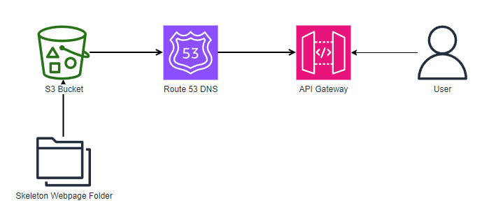

#                      PortfolioPal 

Today marks the launch of PortfolioPal, a cutting-edge web service designed to empower users in creating professional and hassle-free online portfolios. This innovative platform eliminates the need for complex tools like WordPress, offering a simple and efficient solution for individuals seeking to enhance their online presence during job searches.

PortfolioPal stands out with its user-friendly interface and streamlined process, allowing users to effortlessly input their CV as a PDF and incorporate essential links such as YouTube channels and GitHub profiles. The platform further enables users to customize their portfolio by choosing background colors and crafting a personalized welcome message, making each portfolio a unique reflection of the individual's professional identity.

####  Backend services/AWS Services:
* Amazon S3 - Storing and hosting the webpage
* Amazon Route 53 - Manage domain name and DNS settings
> Architecture Diagram for PortfolioPal

####  Key Features of PortfolioPal:

* Effortless CV Integration: Users can seamlessly upload their CV as a PDF, eliminating the need for extensive formatting and technical expertise. 

* Multimedia Integration: PortfolioPal supports the inclusion of multimedia elements such as YouTube channel links, GitHub repositories, and more, providing a comprehensive view of the user's skills and achievements. 

* Customization Options: Users can personalize their portfolio by choosing background colors that align with their personal brand and incorporating a welcoming message to make a lasting impression on potential employers. 

* Temporary Work Showcase: PortfolioPal recognizes that job searches are time-sensitive. Users can showcase their past works specifically during the job search period, ensuring relevance and freshness. 

    No Technical Expertise Required: With simple prompts and an intuitive design, PortfolioPal caters to users of all technical backgrounds, making it accessible to a wide range of professionals.

We the founders (Bee, Hawa, Papa, Atta) expressed excitement about the launch, stating, "We understand the challenges job seekers face when creating an online presence. PortfolioPal aims to simplify the process, allowing individuals to focus on what matters most – showcasing their skills and experiences effectively."

Whether you're a recent graduate entering the job market or a seasoned professional looking for new opportunities, PortfolioPal provides the tools needed to stand out in a competitive job market.

Visit www.portfoliopal.com to start building your online portfolio today and take the next step towards career success.

####  About PortfolioPal:

PortfolioPal is a user-friendly web service dedicated to simplifying the creation of online portfolios for job seekers. With a focus on customization, multimedia integration, and ease of use, PortfolioPal empowers individuals to present their skills and experiences in the best possible light.

####  FAQ:

1. Is PortfolioPal compatible with all devices and browsers?
Yes, PortfolioPal is designed to be responsive and works well across various devices and popular browsers. Whether you're accessing it from a desktop, tablet, or mobile device, the platform is optimized for a seamless experience.

2. Can I update my portfolio after creating it?
Definitely! PortfolioPal allows users to edit and update their portfolios at any time. You can add new content, modify existing information, or change the design elements as needed.

3. Is there a limit to the number of projects or works I can showcase in my portfolio?
PortfolioPal doesn’t impose strict limitations on the number of projects or works you can display. You can include a comprehensive range of your professional experiences to showcase your skills effectively.

4. Are the portfolios created on PortfolioPal search engine optimized (SEO)?
Yes, PortfolioPal implements basic SEO practices to ensure that your portfolio is discoverable by search engines. However, for advanced SEO strategies, additional optimization might be required.

5. How secure is the information uploaded to PortfolioPal?
PortfolioPal prioritizes user data security. The platform employs industry-standard security measures to protect the information uploaded by users. All data is encrypted and handled with utmost confidentiality.

6. Can I share my PortfolioPal portfolio with others or embed it on external websites?
Absolutely! PortfolioPal provides sharing options that allow you to share your portfolio with others via a unique URL. Additionally, you can embed your portfolio on personal websites or other online platforms.

7. Does PortfolioPal offer customer support in case of any issues or queries?
Yes, PortfolioPal offers customer support to assist users with any issues, queries, or technical difficulties they may encounter while using the platform. There's a dedicated support team available to address your concerns promptly.

8. Is PortfolioPal free to use, or are there subscription plans?
PortfolioPal may have both free and premium subscription plans available. While certain basic features might be accessible for free, premium plans might offer additional functionalities and customization options.

If you have more questions or need further assistance, feel free to reach out to PortfolioPal's support team via their website!